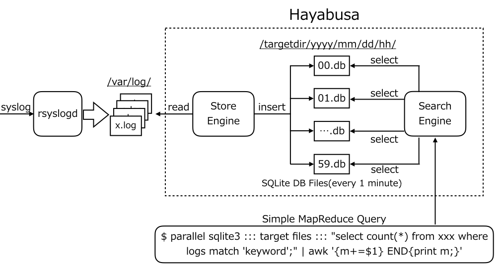

# Hayabusa
Hayabusa: A Simple and Fast Full-Text Search Engine for Massive System Log Data

# Concept
- Pure python implement
- Parallel SQLite processing engine
- SQLite3 FTS(Full Text Search) funstionaaa
- Core-scale architecture

# Architecture
- Design of the directory structure
  - By specifying a search range of time in ”the directory path + yyyy + mm + dd + hh + min.db”, the search program can select the search time systematically.
  ```
  /targetdir/yyyy/mm/dd/hh/min.db
  ```

- StoreEngine
  - sample code
  ```
  import os.path import sqlite3
  db_file = ’test.db’ log_file = ’1m.log’
  
  if not os.path.exists(db_file):
      conn = sqlite3.connect(db_file) conn.execute("CREATE VIRTUAL TABLE SYSLOG USING FTS3(LOGS)");
      conn.close()
  conn = sqlite3.connect(db_file)
  
  with open(log_file) as fh:
      lines = [[line] for line in fh] 
      conn.executemany(’INSERT INTO SYSLOG VALUES ( ? )’, lines) 
      conn.commit()
  ```

- SearchEngine
  - sample command
  ```
  $ python search_engine.py -h
  usage: search_engine.py [-h] [--time TIME] [--match MATCH] [-c] [-s] [-v]
  
  optional arguments:
    -h, --help     show this help message and exit
    --time TIME    time explain regexp(YYYY/MM/DD/HH/MIN). eg: 2017/04/27/10/*
    --match MATCH  matching keyword. eg: noc or 'noc Login'
    -c             count
    -s             sum
    -v             verbose
   
   $ python search_engine.py --time 2017/05/11/13/* --match 'keyword' -c 
   ```
  - Architecture image
  

# Search condition
- case-insensitive
  - no distinguish uppercase or lowercase
- AND
    ```
    --match 'Hello World'
    ```
- OR
    ```
    --match 'Hello OR World'
    ```
- NOT
    ```
    --match 'Hello World -Wide'
    ```
- PHRASE
    ```
    --match '"Hello World"'
    ```
- asterisk(*)
    ```
    --match 'H* World'
    ```
- HAT
    ```
    --match '^Hello World'
    ```

# Development environment
- CentOS 7.3
- Python 3.5.1(use anaconda packages)
- SQLite3(version 3.9.2)

# Dependency softwares
- Python 3
- SQLite3
- GNU Parallel

# Benchmark
- TBD
